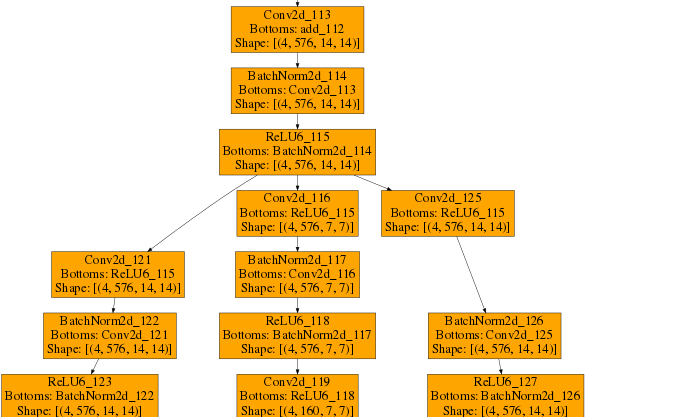

# DFQ
PyTorch implementation of [Data Free Quantization Through Weight Equalization and Bias Correction](https://arxiv.org/abs/1906.04721) with some ideas from [ZeroQ: A Novel Zero Shot Quantization Framework](https://arxiv.org/abs/2001.00281).

## Results on classification task
- Tested with [MobileNetV2](https://github.com/tonylins/pytorch-mobilenet-v2)

<table>
<tr><th>ImageNet validation set (Acc.)   </th></tr>
<tr><td>

model/precision | FP32 | Int8*|
-----------|------|------|
Original   | 71.81 | 0.09
+ReLU | 71.78 | 0.15
+ReLU+LE | 71.78 | 70.32
+ReLU+LE +Distill | -- | 70.41
+ReLU+BC  |  --  | 56.35
+ReLU+BC +clip_15  |  --  | 65.76
+ReLU+LE+BC  |  --  | 70.93

</td></tr> </table>

## Results on segmentation task
- Tested with [Deeplab-v3-plus_mobilenetv2](https://github.com/jfzhang95/pytorch-deeplab-xception)  
<table>
<tr><th>Pascal VOC 2012 val set (mIOU) </th><th>Pascal VOC 2007 test set (mIOU)</th></tr>
<tr><td>

model/precision | FP32  | Int8*|
----------------|-------|-------|
Original  | 70.81 |  59.63
+ReLU     | 70.72 |  60.1
+ReLU+LE  | 70.72 | 65.61
+ReLU+BC  |  --  |  68.7
+ReLU+BC +clip_15  |  --  | 65.69
+ReLU+LE+BC  |  --  | 69.27

</td><td>

model/precision | FP32  | Int8*  
----------------|-------|-------  
Original | 74.54 |  62.5
+ReLU    | 74.35 |  61.54
+ReLU+LE  | 74.35 | 69.24
+ReLU+BC  |  --  |  71.67
+ReLU+BC +clip_15  |  --  | 68.89
+ReLU+LE+BC  |  --  | 72.99

</td></tr> </table>

## Results on detection task  
- Tested with [MobileNetV2 SSD-Lite model](https://github.com/qfgaohao/pytorch-ssd)

<table>
<tr><th>Pascal VOC 2012 val set (mAP with 12 metric)   </th><th>Pascal VOC 2007 test set (mAP with 07 metric)  </th></tr>
<tr><td>

model/precision | FP32 | Int8*|
-----------|------|------|
Original   | 70.95 | 65.49
+ReLU     | 67.44 | 65.85
+ReLU+LE  | 67.44 | 66.52
+ReLU+BC  |  --  |  66.05
+ReLU+BC +clip_15  |  --  | 66.2
+ReLU+LE+BC  |  --  | 66.5

</td><td>

model/precision | FP32  | Int8*  
----------------|-------|-------  
Original | 60.5 |  58.4
+ReLU     | 57.61 | 58.09
+ReLU+LE  | 57.61 | 58.74
+ReLU+BC  |  --  | 58.55
+ReLU+BC +clip_15  |  --  | 58.63
+ReLU+LE+BC  |  --  | 58.6

</td></tr> </table>

## Usage
There are 6 arguments, all default to False
  1. quantize: whether to quantize parameters and activations.  
  2. relu: whether to replace relu6 to relu.  
  3. equalize: whether to perform cross layer equalization.  
  4. correction: whether to apply bias correction
  5. clip_weight: whether to clip weights in range [-15, 15] (for convolution and linear layer)
  6. distill: whether to use distill data for setting min/max range of activation quantization

run the equalized model by:
```
python main_cls.py --quantize --relu --equalize
```

run the equalized and bias-corrected model by:
```
python main_cls.py --quantize --relu --equalize --correction
```

run the equalized and bias-corrected model with distilled data by:
```
python main_cls.py --quantize --relu --equalize --correction --distill
```

## Note
### Distilled Data (2020/02/03 updated)
  According to recent paper [ZeroQ](https://github.com/amirgholami/ZeroQ), we can distill some fake data to match the statistics from batch-normalization layers, then use it to set the min/max value range of activation quantization.  
  It does not need each conv followed by batch norm layer, and should produce better and **more stable** results using distilled data (the method from DFQ failed on some models due to too large value range).  

  Here are some modifications that differs from original ZeroQ implementation:
  1. Initialization of distilled data
  2. Early stop criterion

  Also, I think it can be applied to optimizing cross layer equalization and bias correction. The results will be updated as long as I make it to work.  
  For cross layer equalization, it actually performs worse than standard method from DFQ in mobilenetv2 classification task. However, it provide some possibility to optimize structures like branching.  
  

### Fake Quantization
  The 'Int8' model in this repo is actually simulation of 8 bits, the actual calculation is done in floating points.  
  This is done by quantizing-dequantizing parameters in each layer and activation between 2 consecutive layers;  
  Which means each tensor will have dtype 'float32', but there would be at most 256 (2^8) unique values in it.  
  ```
    Weight_quant(Int8) = Quant(Weight)
    Weight_quant(FP32) = Weight_quant(Int8*) = Dequant(Quant(Weight))
  ```

### 16-bits Quantization for Bias
  Somehow I cannot make **Bias-Correction** work on 8-bits bias quantization (even with data dependent correction).  
  I am not sure how the original paper managed to do it with 8 bits quantization, but I guess they either use some non-uniform quantization techniques or use more bits for bias parameters as I do.

## TODO
- [x] cross layer equalization
- [ ] high bias absorption
- [x] data-free bias correction
- [x] test with detection model
- [x] test with classification model
- [x] use distilled data to set min/max activation range
- [ ] use distilled data to find optimal scale matrix
- [ ] use distilled data to do bias correction
- [ ] True Int8 inference

## Acknowledgment
- https://github.com/jfzhang95/pytorch-deeplab-xception
- https://github.com/ricky40403/PyTransformer
- https://github.com/qfgaohao/pytorch-ssd
- https://github.com/tonylins/pytorch-mobilenet-v2
- https://github.com/xxradon/PytorchToCaffe
- https://github.com/amirgholami/ZeroQ
